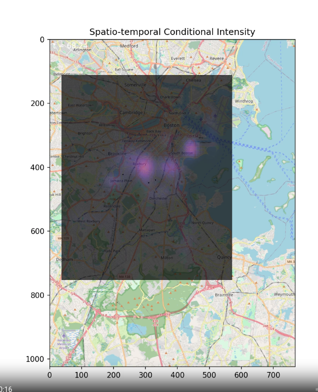

# Modeling Boston Crimes using Deep Spatio-Temporal Point Processes 

This repository contains an analysis of violent crime data in Boston and models Boston crimes using spatio-temporal point processes. The currently implemented spatio-temporal models are based on the work of Rose Yu, as described in [Zhou et al., "Neural Point Process for Learning Spatiotemporal Event Dynamics", arXiv:2112.06351](https://arxiv.org/abs/2112.06351). The corresponding code is available in the [DeepSTPP](https://github.com/Rose-STL-Lab/DeepSTPP/tree/master) GitHub repository. A significant portion of the modeling code was adapted or directly borrowed from this repository.

My plan is to eventually add new model architectures for spatio-temporal point process modeling. The explanation of key files is below

## boston-crimes-stpp.ipynb

This file trains spatio-temporal neural network models, which leverage neural networks to model the conditional intensity function. It also generates various visualizations, including an animation that illustrates the evolving intensity function in 3D and overlaid on a map (see figure below). The animations generated can be viewed in the `video` directory.

**Figure 1:** Spatio-temporal intensity heat map overlayed over Boston. A brighter color indicates higher likelihood of a violent crime.

## boston_stpp_analysis.r

Some R code to plot boston violent crime using R's stpp tools.

## crimes-path-analysis.ipynb

Uses google maps API and the boston crime database to get summary statistics on a walking path

Essentially a way to practice geopandas and useful code in case I need to work on spatial data.

The main code is in `crimes-path-analysis.ipynb`.  Likely it can't be viewed on github due to rendering issues but
it can be viewed [at this location](https://nbviewer.org/github/jaime-varela/bostonCrimeVisualizationOnPath/blob/main/crimes-path-analysis.ipynb) , which uses nbviewer.

# Future Work

1. Add additional spatio-temporal modeling techniques and quantify the likelihood.
2. Verify dataset preparation, in particular the sampling method used.
3. Add methods to compute the "probability of violent crime occuring on a path". This requires an integral over the space-time intensity function.
4. Examine "spikes" in spatio-temporal intensity when new events come in. This spiking behavior is likely due to the kernel based method used in DeepSTTP.